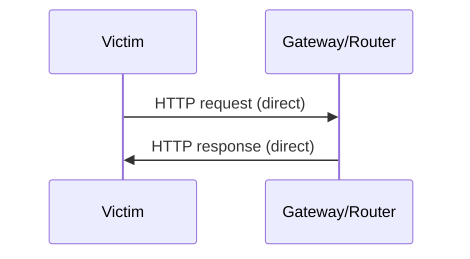
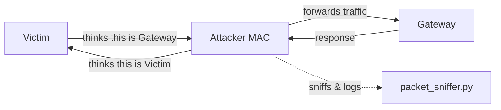
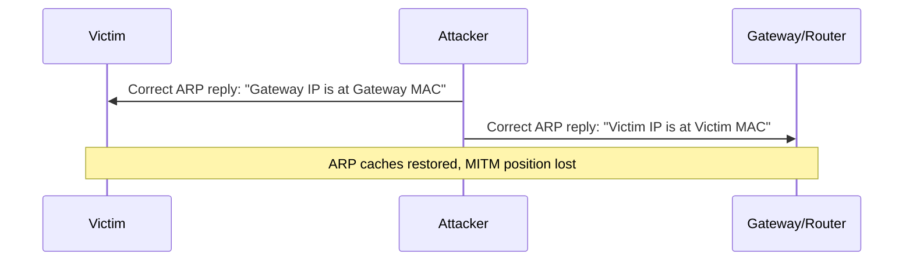

# ARP MITM Attack Flow

## Before the attack — normal traffic

Victim and gateway talk directly. Each has the other's *correct* MAC address cached in its ARP table.

## Step 1 — ARP poisoning

`arp_spoofer.py` sends unsolicited ARP replies to both sides. Neither victim nor gateway verifies who actually sent the reply — ARP has no authentication — so both caches get overwritten with the attacker's MAC.

## Step 2 — Traffic flows through the attacker

With IP forwarding enabled on the attacker machine, traffic is invisibly relayed so the connection still works — but every packet passes through the attacker first, where `packet_sniffer.py` inspects HTTP traffic for credentials.

## Step 3 — Cleanup

`restore_network.py` sends the *true* ARP mappings so both hosts revert to talking directly, closing the MITM window.

## Why this works

ARP is a stateless, unauthenticated broadcast protocol — any host on the local segment can claim to own any IP address, and other hosts will believe the most recent reply. There's no signature, no challenge/response, nothing to verify.

## Real-world defenses

- **Dynamic ARP Inspection (DAI)** on managed switches — validates ARP packets against a trusted DHCP snooping table
- **Static ARP entries** for critical hosts (gateway, servers)
- **802.1X port authentication** to control who can even join the segment
- **Encrypted transport (HTTPS/TLS)** — doesn't stop the MITM position, but stops the attacker from reading the actual content
