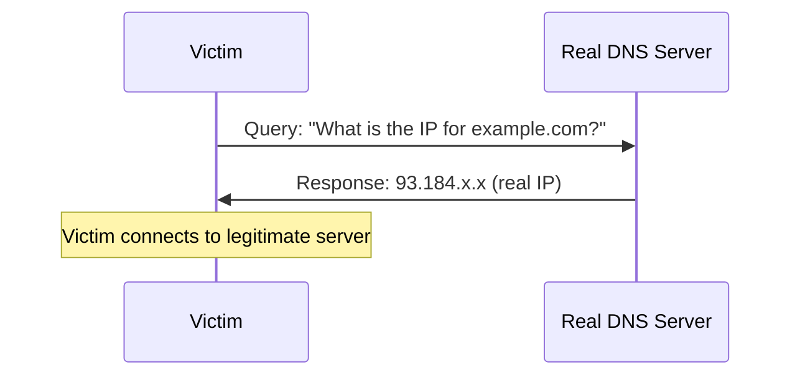
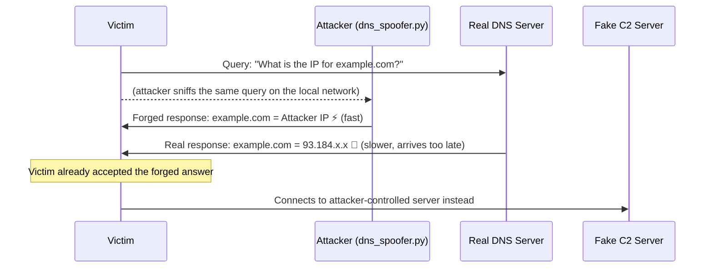
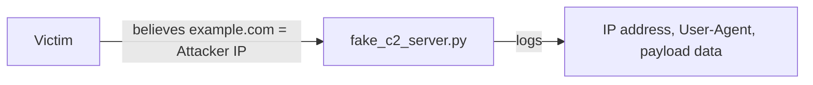

# DNS Poisoning Attack Flow

## Normal DNS resolution

## The attack — response racing

`dns_spoofer.py` sniffs for DNS queries matching the target domain and races a forged UDP response back to the victim before the legitimate DNS server's reply arrives. DNS over UDP has no built-in authentication of *who* sent the response — only a 16-bit transaction ID, which the spoofer copies from the intercepted query — so the victim has no way to tell the forged answer apart from a real one.

## Step 2 — victim connects to attacker infrastructure

Once redirected, the victim's traffic goes to `fake_c2_server.py`, which simulates what real attacker-controlled infrastructure does: log every check-in (a "beacon") with the source IP, User-Agent string, and any data sent — the same signal defenders look for when hunting for C2 traffic on their own networks.

## Why this works

- DNS over UDP/53 has no default authentication of responses
- The only "secret" is a 16-bit transaction ID and matching source port — both guessable/sniffable on a local network
- Whichever response arrives first wins; the real server has no way to preempt a faster forged reply

## Real-world defenses

- **DNSSEC** — cryptographically signs DNS responses so forged answers fail validation
- **Encrypted DNS (DoH/DoT)** — prevents on-path attackers from even seeing the plaintext query to spoof a response to
- **DNS monitoring/anomaly detection** — flag unexpected answer changes or beacon-like traffic patterns
- **Egress filtering** — restrict outbound connections to known-good destinations
