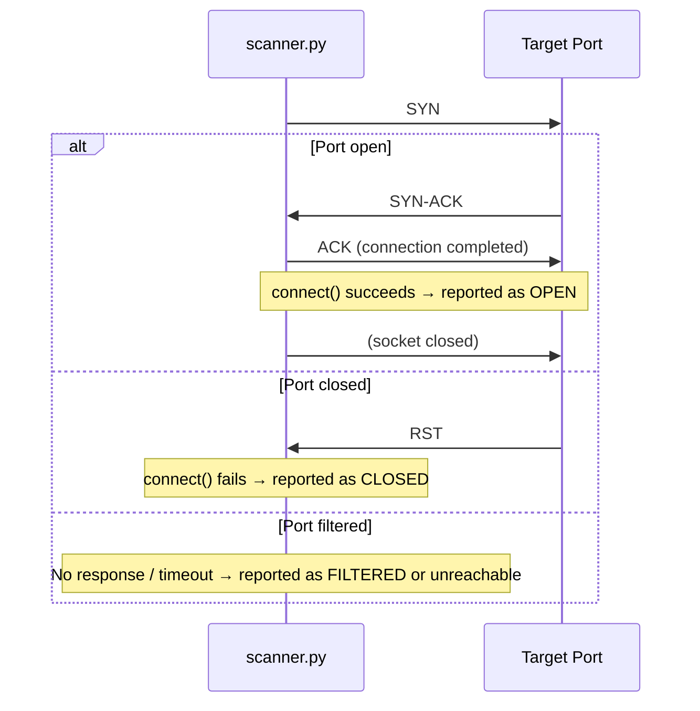
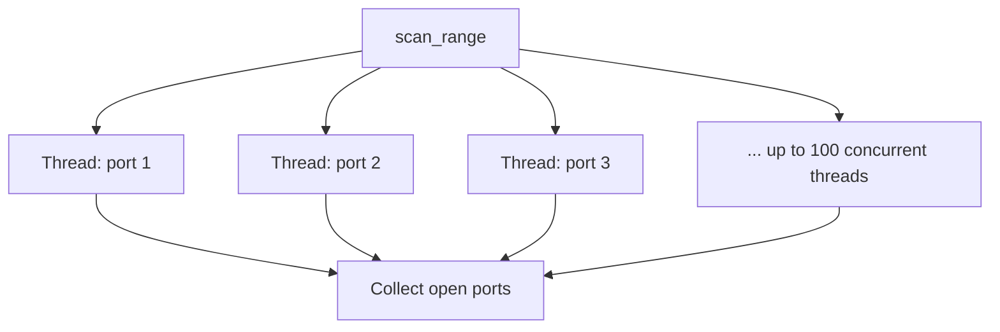
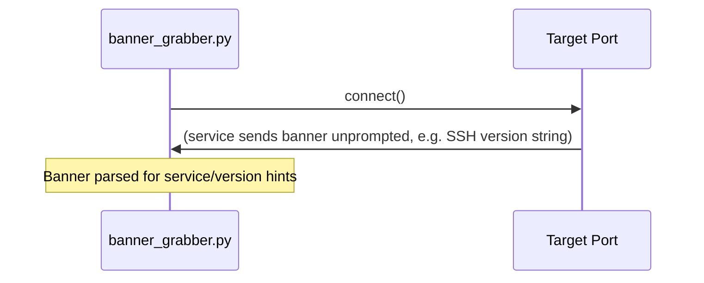
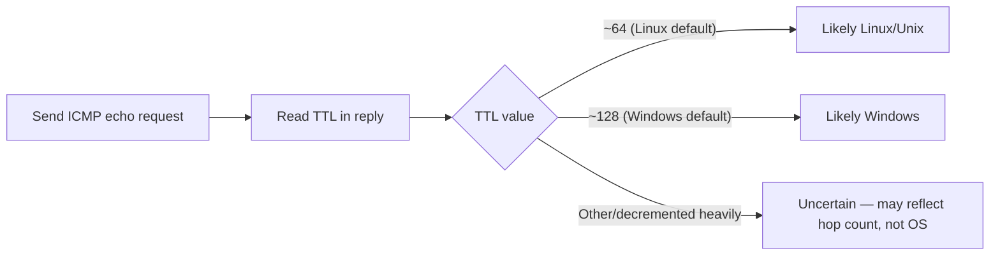

# Protocol Notes: TCP Connect Scanning & TTL Fingerprinting

## TCP connect scan — full three-way handshake

`scanner.py` uses a full `connect()` call (not a raw SYN scan), so it completes the entire three-way handshake for every port it tests. This is simpler to implement than a stealth SYN scan and doesn't require raw socket privileges, but it's slower and **noisier** — a completed connection is far more likely to show up in the target's logs than a half-open SYN scan would.

## Concurrency model

A `ThreadPoolExecutor` fans the scan out across up to 100 worker threads at once instead of testing 1,024 ports sequentially — turning a scan that could take minutes into one that takes seconds. This is exactly the kind of behavior an IDS/IPS looks for (many connection attempts from one source in a short window).

## Banner grabbing

Many services (SSH, FTP, SMTP) announce themselves immediately after a TCP connection completes. `banner_grabber.py` just connects and reads whatever comes back — no protocol-specific handshake needed for a basic banner.

## TTL-based OS fingerprinting

Different OS families ship with different default starting TTLs (commonly 64 for Linux/Unix, 128 for Windows, 255 for some network gear). Since TTL decrements by 1 per router hop, `fingerprint.py`'s guess gets less reliable the more hops away the target is — this is a coarse heuristic, not a fingerprint in the Nmap `-O` sense (which combines TTL with TCP options, window size, and other signals).

## Defensive notes

- **Banner suppression / generic banners** reduce information leakage to recon tools
- **Rate limiting and IDS alerting** on high-volume connection attempts can catch scans like this in progress
- **Firewalls with default-deny** turn "closed" ports into "filtered," denying the scanner even a clean RST to work with
